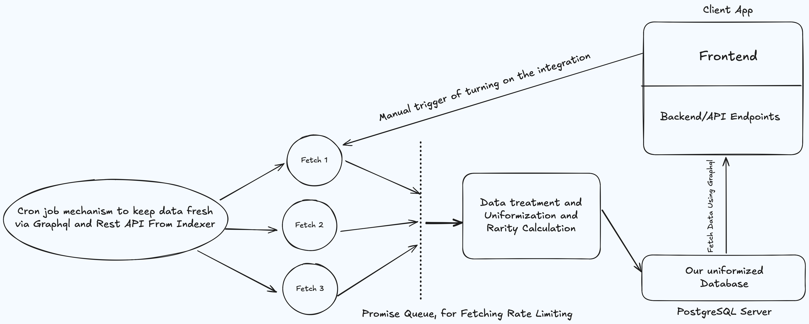

# 🔁 Data Integration Workers

This repository contains a robust and modular system to fetch, process, and store collection data—such as floor price and volume—from indexers using GraphQL and REST APIs. The system ensures data freshness and consistency using scheduled jobs, a throttled batch processor, and a PostgreSQL backend. This data powers your client app's backend API endpoints.

---

## 🧠 Architecture Overview



### Flow Summary

1. **Cron Job Mechanism**  
   Automatically fetches collection data periodically via GraphQL and REST APIs from an indexer.

2. **Promise Queue**  
   Fetch operations are wrapped in a throttled promise queue (`p-queue`) to avoid rate limiting issues.

3. **Fetch Workers**  
   - **Fetch 1**: Collection Floor Prices  
   - **Fetch 2**: Collection Volumes  
   - **Fetch 3**: Collection Metadata  

4. **Data Treatment & Rarity Calculation**  
   Raw data is cleaned, normalized, and enriched with rarity scores.

5. **Database Storage**  
   Processed data is stored in a unified PostgreSQL database.

6. **Client App Consumption**  
   The client app accesses this data through GraphQL queries to backend API endpoints.

---

## 🛠️ Tech Stack

- **Language**: TypeScript
- **Database**: PostgreSQL (via Prisma ORM)
- **Queueing**: [`p-queue`](https://www.npmjs.com/package/p-queue) for throttled fetch handling
- **HTTP Client**: `axios`
- **GraphQL Client**: `graphql-request`
- **Job Scheduling**: Cron-based scheduling (outside current script, assumed via infrastructure)

---

## 📦 Installation

```bash
git clone https://github.com/your-org/workers.git
cd workers
npm install
```

---

## 🧪 Development

```bash
npm run dev
```

This uses `tsc-watch` to compile and run `index.ts` on code changes.

---

## 🚀 Production

```bash
npm run build
npm start
```

---

## 🗃️ Database Commands

- Generate Prisma client:
  ```bash
  npm run db:generate
  ```

- Apply schema migrations:
  ```bash
  npm run db:migrate
  ```

- Open Prisma Studio (GUI for DB):
  ```bash
  npm run db:studio
  ```

---

## 🧩 Manual Trigger

You can optionally enable manual integration triggering via the client app, which connects to the `Fetch 1` worker (e.g., to allow admin control or custom refreshes).

---

## 📌 Notes

- Ensure rate limits are respected by tuning `batchSize` and `intervalMs` in the batch processor.
- Cron job setup is assumed to be managed externally (e.g., via `node-cron`, Kubernetes cron jobs, or GitHub Actions).

